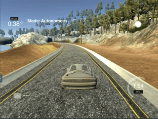

# Path Planning Project

### Project Description

>  In this project, your goal is to design a path planner that is able to create smooth, safe paths for the car to follow along a 3 lane highway with traffic. A successful path planner will be able to keep inside its lane, avoid hitting other cars, and pass slower moving traffic all by using localization, sensor fusion, and map data.

See full description for the project in [here](https://github.com/linyilu0323/CarND_P7_PathPlanning/blob/master/Project_Instructions.md).

------

### Introduction

In this project, what you're provided:

- Road map: a list of waypoint data `[x, y, s, dx, dy]` containing each point's global map "x-y" position, Frenet coordinate "s" position, and the Frenet "d" unit vector (points perpendicular to the road in the right hand side direction).
- Main car's localization data: contains `x, y, s, d, yaw, speed` information of the main car.
- Sensor fusion data: contains all the information about the cars on the right-hand side of the road, the format for each car is: `[id, x, y, vx, vy, s, d]`.
- Previous path data given to the planner.

It is desired to generate a pair of `[x, y]` coordinates for the car to follow every 20ms.

### Implementation Details

**1. PID Control Concept**

   - Proportional Gain: control effort is proportional to the error. - A single P controller would usually result in "overshoot" and subsequent oscillation.
   - Integral Gain: control effort is proportional to the integral of error over time. - Often helpful when there is an intrinsic system error that is beyond controller.
   - Differential Gain: control effor is proportional to the derivative of error. - Reduces oscillation but response is slower.

**2. Implementation**

I started to tune the PID controller by using a constant throttle (0.5), and observe the vehicle driving with different control parameter tunings.

- P-Gain only: 

  | P Gain Value | Result                                                       |
  | ------------ | ------------------------------------------------------------ |
  | 3            |                               |
  | 0.3          |  |
  | 0.003        |  |

  From above experiment, the larger the P gain, the faster system responds to the error, but also the larger the oscillation. None of the above case would finish one loop without crash. However, it seems a P-gain of around 0.3 is suitable as a starting point.

- Adding D-Gain:

  Continuing by adding other terms, I skipped the I gain because I don't think there is systematic error with the simulator. I again tested 3 cases with a constant P gain of 0.3.

  | D Gain Value | Result                                                       |
  | ------------ | ------------------------------------------------------------ |
  | 0.3          |  |
  | 10           |  |
  | 100          |  |

  A large D gain (Kd = 100) seem to keep the vehicle in the middle of the lane but the residue oscillation seems annoying, the magnitude is small but I think the constant high frequency oscillation would make passenger feel worse. A small D gain (Kd = 0.3) is probably too ineffective, it doesn't help to reduce and control the maginitude of oscillation.

- Fine Tune

  I tried to use a "manual" twiddle process to tune PID controller with P and D components only, I ended up choosing Kp = 0.3 and Kd = 8. The vehicle was able to drive a full loop without falling out.

#### **A self check against the rubrics:**

:white_check_mark: The PID procedure follows what was taught in the lessons.

:white_check_mark: Describe the effect each of the P, I, D components had in your implementation.  *- you're reading this*

:white_check_mark: Describe how the final hyperparameters were chosen. 

:white_check_mark: The vehicle must successfully drive a lap around the track.

### Future Improvements

- Implement twiddle algorithm: Run a complete loop with different PID gain tuning and use twiddle algorithm to fine tune the gains would be an interesting project. 
- Add a PID controller for throttle control: If adding another PID controller to the throttle, we may be able to achieve a faster speed.

